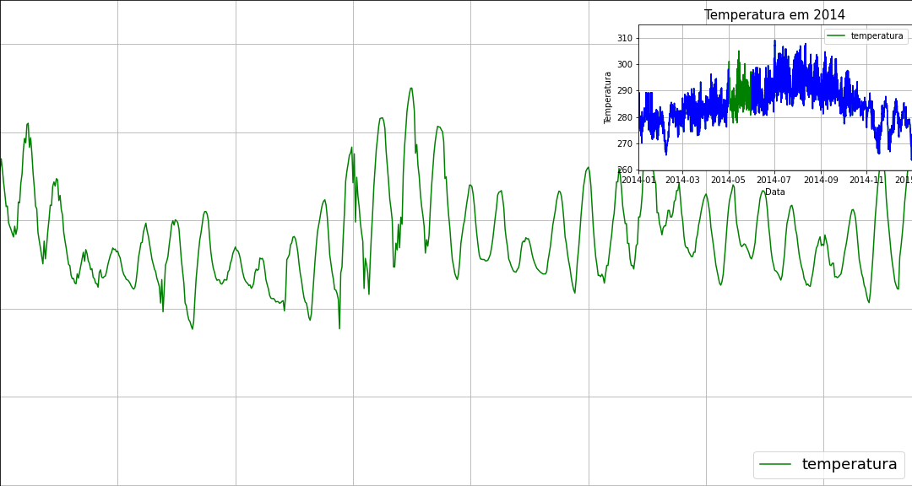
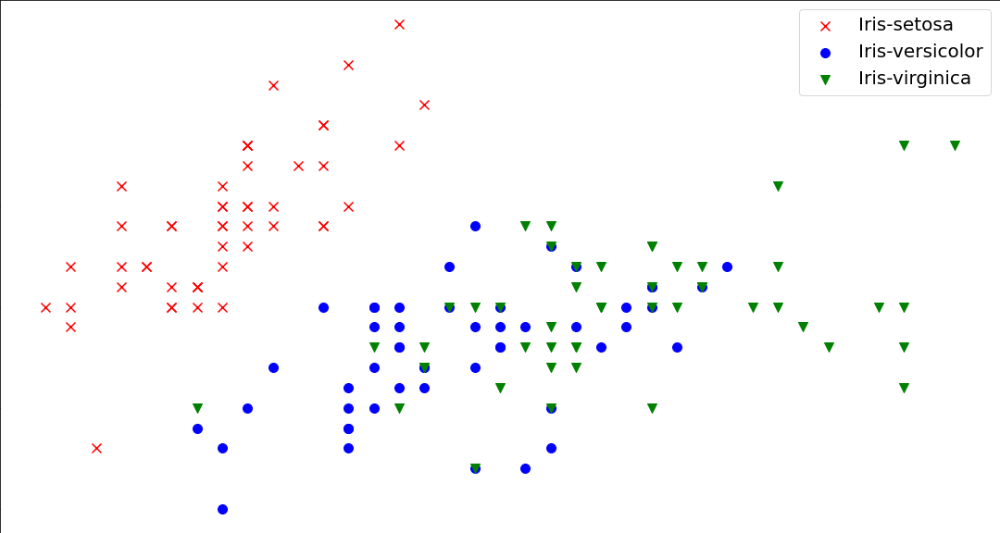
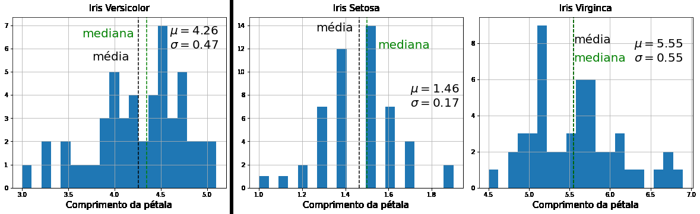

<h1 align="center", b>Matplotlib Labs</h2></b>

&nbsp;
&nbsp;
&nbsp;
---
Este repositório contem as atividades desenvolvidas ao longo do treinamento <i>**Data Visualization: criação de gráficos com o Matplotlib** </i>,  promovido pela Alura e Grupo Boticário.

---

<h2> Gráfico Variação de Temperatura - Estação Meteorológica</h2> 

---

<h2> Gráfico de Dispersão - Tamanhos Pétala e Sépula</h2> 

---

<h2> Histogramas</h2> 

