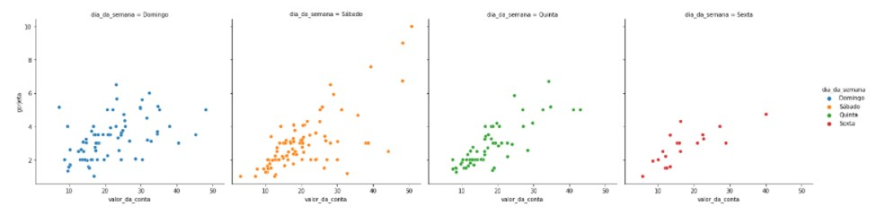

<h1 align="center", b>Seaborn lab exercises</h2></b>

&nbsp;
&nbsp;
&nbsp;
&nbsp;
---
Este repositório contem as atividades desenvolvidas ao longo do treinamento <i>**Data Visualization: explorando com Seaborn** </i>,  promovido pela Alura e Grupo Boticário.

Para maiores informações sobre os recursos deste framework, veja por favor o link <a href="[url](https://seaborn.pydata.org/#)">Seaborn - statistical data visualization.</a>

---

A seguir alguns exemplos dos gráficos criados neste laboratório.

--- 
<h2> Gráfico gorjeta x valor da conta</h2> 

---

<h2> Gráfico gorjeta x valor da conta e influência da sobremesa</h2> 

---

<h2> Gráficos de gorjetas por dias da semana </h2> 

<h2> Gráficos Valor da conta por hora do dia </h2> 

